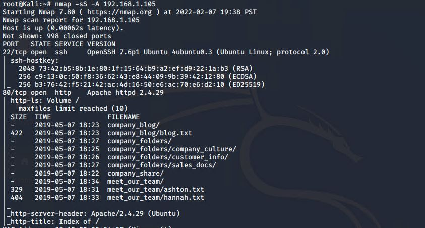
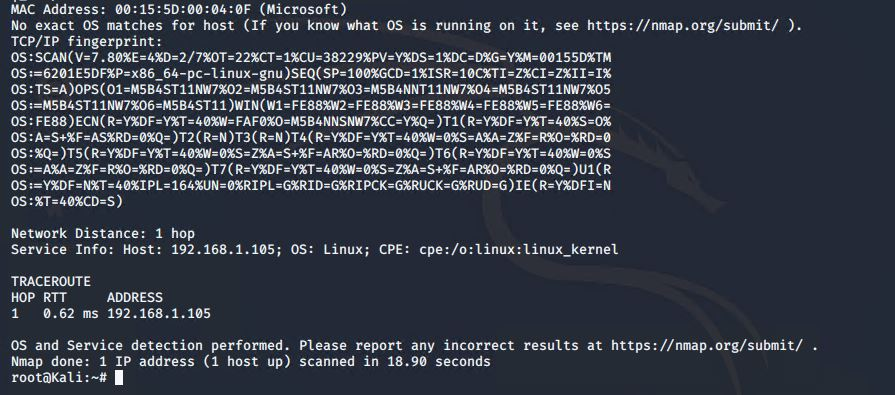
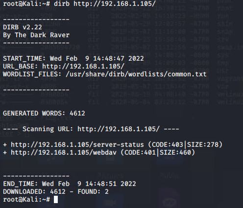
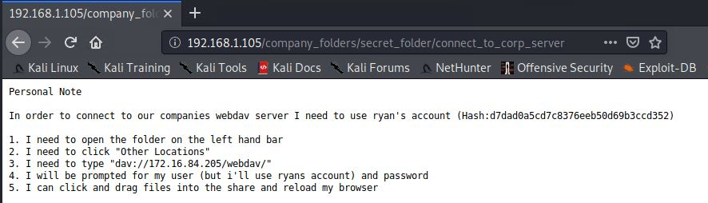
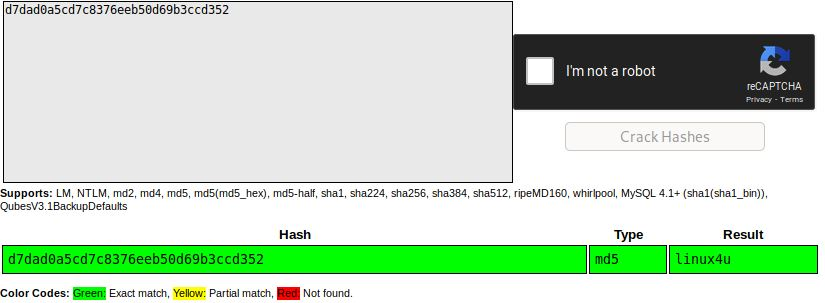
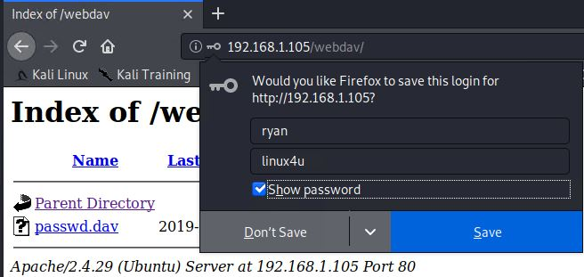
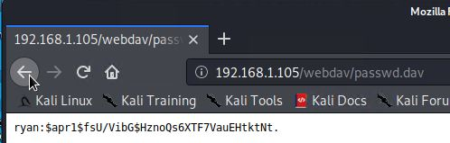

## Day 1 Activity File: Red Team

### Monitoring Setup Instructions

- As the you attack a web server today, it will send all of the attack info to an ELK server.

- The following setup commands need to be run on the **Capstone** machine before the attack takes place in order to make sure the server is collecting logs.

- Be sure to complete these steps before starting the attack instructions.

**Instructions**

- Double click on the 'HyperV Manager' Icon on the Desktop to open the HyperV Manager.

- Choose the `Capstone` machine from the list of Virtual Machines and double-click it to get a terminal window.

- Login to the machine using the credentials: `vagrant:tnargav`

- Switch to the root user with `sudo su`
> .JPG)

#### Setup Filebeat

Run the following commands:
- `filebeat modules enable apache`
- `filebeat setup`

> .JPG)

#### Setup Metricbeat

Run the following commands:
- `metricbeat modules enable apache`
- `metricbeat setup`

> .JPG)

#### Setup Packetbeat

Run the following command:
- `packetbeat setup`

> .JPG)

Restart all 3 services. Run the following commands:
- `systemctl restart filebeat`
- `systemctl restart metricbeat`
- `systemctl restart packetbeat`

These restart commands should not give any output:

.JPG)

Once all three of these have been enabled, close the terminal window for this machine and proceed with your attack.

---

### Attack!

Today, you will act as an offensive security Red Team to exploit a vulnerable Capstone VM.

You will need to use the following tools, in no particular order:
- Firefox
- Hydra
- Nmap
- John the Ripper
- Metasploit
- curl
- MSVenom

### Setup

Your entire attack will take place using the `Kali Linux` Machine.

- Inside the HyperV Manager, double-click on the `Kali` machine to bring up the VM login window.

- Login with the credentials: `root:toor`

### Instructions

Complete the following to find the flag:

- Discover the IP address of the Linux web server.
> Command: `ifconfig`
> 
> .JPG)
> 
> Command: `nmap -sS -sV 192.168.1.105`
> 
> .JPG)
> 
> Command: `nmap -sS -A 192.168.1.105`
> 
> 
> 
> 

- Locate the hidden directory on the web server.
> 

- Brute force the password for the hidden directory using the hydra command:
> 
> Command: `hydra -l ashton -P ~/Downloads/rockyou.txt -s 80 -f -vV 192.168.1.105 http-get /company_folders/secret_folder`
> .JPG)
> After gaining access to the `/secret_folder` using `ashton` & `leopoldo` I was able to view a file which contained the log in information required to access the `WebDav`.
>
> 

- Break the hashed password with the Crack Station website or John the Ripper.
>
> Ryan's hash: `d7dad0a5cd7c8376eeb50d69b3ccd352`
> 
> 

- Connect to the server via WebDav.
>
> After cracking the `md5` hash, I logged into the `WebDav` server using `ryan` & `linux4u`.
> 
> 
>
> Once inside the parent directory, I accessed the file named `passwd.dav` which contained this:
> 

- Upload a PHP reverse shell payload.
    - **Hint**: Try using your scripting skills! MSVenom may also be helpful.
- Execute payload that you uploaded to the site to open up a meterpreter session.
- Find and capture the flag.

After you have captured the flag, show it to your instructor.

Be sure to save important files (e.g., scan results) and take screenshots as you work through the assessment. You'll use them again when creating your presentation.

---
© 2020 Trilogy Education Services, a 2U, Inc. brand. All Rights Reserved.
