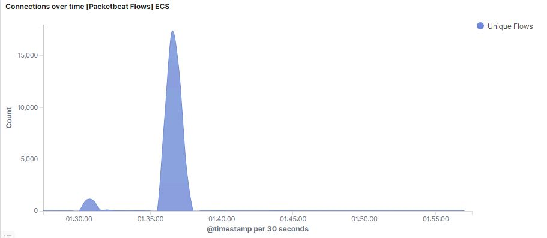
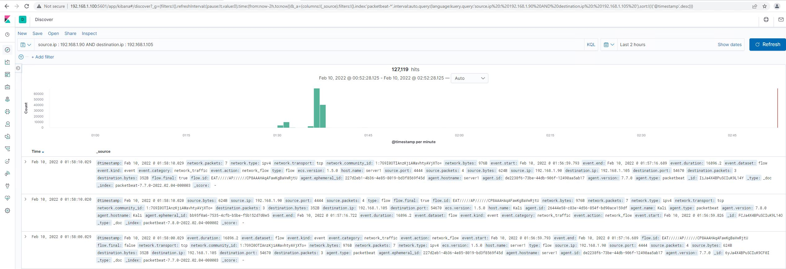
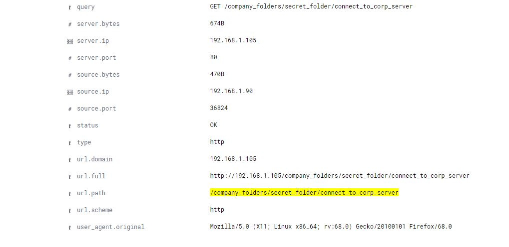
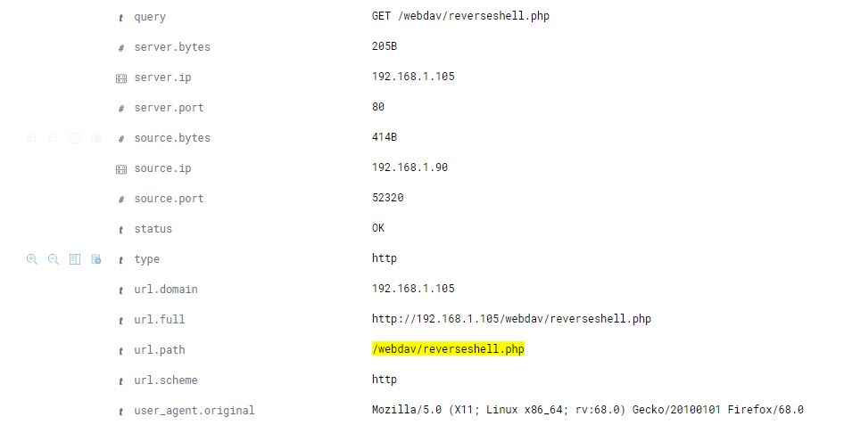

### Answer's for Day 2 Readme

1. Identify the offensive traffic.
   - Identify the traffic between your machine and the web machine:
     - When did the interaction occur?
       > Answer: The interaction between the `Kali :: 192.168.1.90` machine, and the target `Capstone :: 192.168.1.105` machine began @0130 UTC (1730 PST) and ended @0205 (1805 PST) on February 10th, 2022. 
       > 
       > 
       > 
       
     - What responses did the victim send back?
       > Answer: Various `GET` requests and other `HTTP` responses were sent back.
     - What data is concerning from the Blue Team perspective?
       > Large volumes of http requests from the `agent.name: Kali`
       > 

2. Find the request for the hidden directory.
   > Answer: `url.path: "/company_folders/secret_folder/connect_to_corp_server"`
   > 
   > 

   - In your attack, you found a secret folder. Let's look at that interaction between these two machines.
     - How many requests were made to this directory? At what time and from which IP address(es)?
       > Answer: `2`
     - Which files were requested? What information did they contain?
       > Answer: The file contained items like `username: ryan`, ryan's hash: `d7dad0a5cd7c8376eeb50d69b3ccd352`: and the login instructions for the server `http://192.168.1.105/webdav/`
     - What kind of alarm would you set to detect this behavior in the future?
       > Answer: I would set an alarm for all non-whitelisted IP's attempting to access the `secret_folder` directory. 
     - Identify at least one way to harden the vulnerable machine that would mitigate this attack.
       > Answer: The easiest way to harden this vulnerable machine would be to whitelist all devices on the company network infastructure so that no device off the network could access it. 
3. Identify the brute force attack.
   - After identifying the hidden directory, you used Hydra to brute-force the target server. Answer the following questions:
     - Can you identify packets specifically from Hydra?
       > Kibana Search: `source.ip : 192.168.1.90 AND user_agent.original :"Mozilla/4.0 (Hydra)"`
     - How many requests were made in the brute-force attack?
       > Answer: `15,848`
     - How many requests had the attacker made before discovering the correct password in this one?
       > Answer: `15,846`
     - What kind of alarm would you set to detect this behavior in the future and at what threshold(s)?
       > Answer: I would set an alarm to trigger after frequent failed loggin attempts. The threshold I would implement for total failed log ins is `5`, however if the evidence shows that there are multiple log ins per millisecond I would also set an alert for that. 
     - Identify at least one way to harden the vulnerable machine that would mitigate this attack.
       > Answer: I would scrub the files online to not include valuable information such as: passwords, hashes, usernames, etc. I would also implement a capcha so that brute forces would need to be much more sophisticated rather than just simply using a wordlist. 

4. Find the WebDav connection.
   - Use your dashboard to answer the following questions:
     - How many requests were made to this directory? 
       > Answer: `33` hits were made: `26` were `http: 207`, `5` were `http: 401`, `2` were `http: 200`. 
     - Which file(s) were requested?
       > Answer: A file name `passwd.dav`
     - What kind of alarm would you set to detect such access in the future?
       > Answer: I would set an alarm for all non-whitelisted IP's attempting to access the `/webdav` directory.
     - Identify at least one way to harden the vulnerable machine that would mitigate this attack.
       > Answer: The easiest way to harden this vulnerable machine would be to whitelist all devices on the company network infastructure so that no device off the network could access it.
5. Identify the reverse shell and meterpreter traffic.
   - To finish off the attack, you uploaded a PHP reverse shell and started a meterpreter shell session. Answer the following questions:
     - Can you identify traffic from the meterpreter session?
       > Answer: Yes.
       > 
     - What kinds of alarms would you set to detect this behavior in the future?
       > Answer: Again, I would set an alarm that would detect of any access from a device outside of the company infastructure. 
     - Identify at least one way to harden the vulnerable machine that would mitigate this attack.
       > Answer: In this particular instance I would start by removing sensitive information instructing people on how to access the Webdav. Then, I would configure the Apache settings to allow uploads from certain IP's only. 
